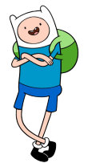
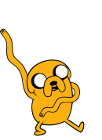

# jahorcado.github.io
<!DOCTYPE html>

<head>
    <meta charset="UTF-8">
    <link rel="stylesheet" href="reset.css">
    <link rel="stylesheet" href="style.css">
</head>

<body class="principal">
    <header>
        <title>INICIO</title>
    </header>
    <main>
        
        

            <a href="juego.html" class="menu">Iniciar el juego</a>
            
            <a href="agregapalabra.html" class="menu">Agregar Palabra</a>
            
        

    </main>
</body>
